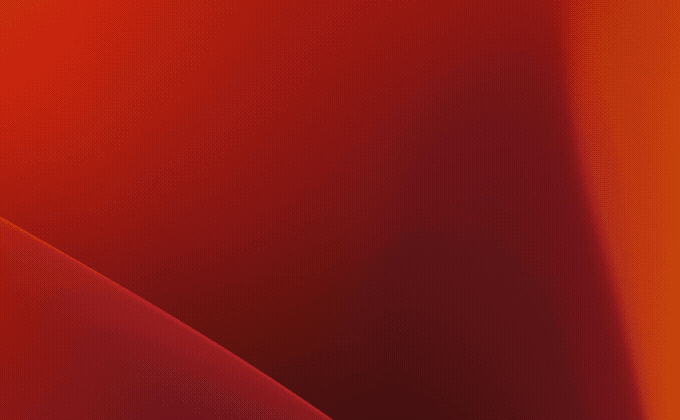

# tauri-launchbar-tutorial

For a more in-depth write up on how to create a launch bar type application using
Rust & Tauri, check our the [tutorial that we wrote](https://blog.spyglass.fyi/posts/2023/creating-a-launcher-in-tauri/)!

    

This template was generated using [create-tauri-app](https://github.com/tauri-apps/create-tauri-app)
and should help get you started developing with Tauri in vanilla HTML, CSS and Javascript.

## Recommended IDE Setup

- [VS Code](https://code.visualstudio.com/) + [Tauri](https://marketplace.visualstudio.com/items?itemName=tauri-apps.tauri-vscode) + [rust-analyzer](https://marketplace.visualstudio.com/items?itemName=rust-lang.rust-analyzer)
